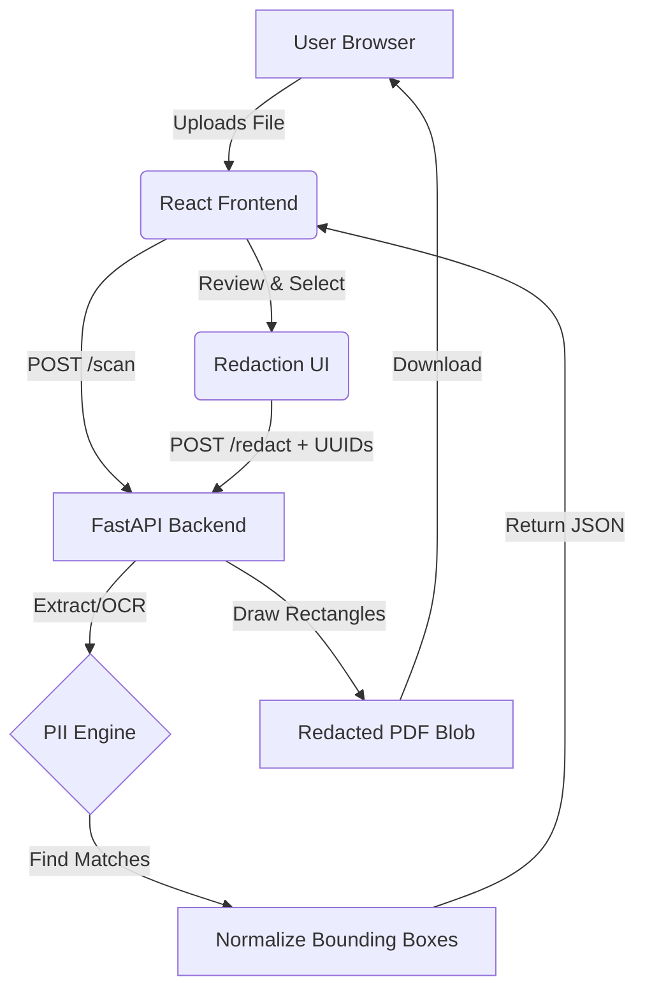

<h1 align="center">PII Shield 🛡️</h1>

<p align="center">
  <strong>Privacy-First. Local-Only. Document Security.</strong><br>
  <em>Personal Data Privacy Analyzer Problem</em><br>
  <strong>Team: Digital Sentinels</strong>
</p>

<p align="center">
  
  
  
  
  
</p>

---

## 📖 Overview
In our increasingly digital world, users often unknowingly share sensitive personal information within documents, exposing themselves to identity theft, data breaches, and misuse. **PII Shield** is a high-performance, client-side focused document scanner designed to detect and redact Personally Identifiable Information (PII) from PDFs and images locally. Built with privacy as the core principle, our solution ensures that your sensitive data never leaves your environment, promoting responsible data sharing practices without compromising security.

## 🚨 Problem Statement
**Personal Data Privacy Analyzer Problem**

Individuals and organizations frequently exchange files (PDFs, images, scanned documents) containing sensitive personal data. 
- **The Challenge**: Users struggle to manually identify and redact sensitive information like Aadhaar, PAN, phone numbers, and email addresses before sharing documents.
- **The Risk**: Unintended sharing leads to an increased risk of data breaches, regulatory non-compliance, and identity fraud.
- **Existing Solutions**: Current tools are either entirely cloud-based (exposing files to third-party servers), lacking in multi-format support, or too complex for the average user to operate seamlessly.

## 💡 Our Solution
PII Shield empowers users to safeguard personal data through a streamlined, privacy-first workflow. Operating entirely on your local machine, the system automatically detects, highlights, and redacts sensitive data with deterministic precision.

**Workflow Pipeline:**
`Upload Document` ➔ `Scan & OCR Extraction` ➔ `Detect Sensitive Data` ➔ `Interactive Masking` ➔ `Secure Output`

## ✨ Key Features
- 🔍 **Sensitive Data Detection**: High-precision identification of Aadhaar, PAN, phone numbers, and email addresses.
- 📄 **Multi-Format & OCR Support**: Process digital PDFs, multi-page PDFs, and raw images (PNG/JPG) using Tesseract.
- 📐 **Orientation-Aware Scanning**: Intelligent processing of documents regardless of their scanned orientation.
- 🛡️ **Automated Redaction & Masking**: Deterministic masking engine that draws permanent black rectangles over selected PII.
- 📊 **Privacy Risk Analysis**: Provides a comprehensive risk score and confidence levels for detected fields.
- 💾 **Secure Export / Download**: Generates a clean, redacted PDF instantly without retaining original data.
- ⚡ **Graceful Degradation (Mock Mode)**: Guarantees UI functionality even if the backend is unavailable (perfect for demos).

## 🛠️ Tech Stack

| Component | Technology | Description |
| :--- | :--- | :--- |
| **Frontend** | React 18, Vite, Vanilla CSS | Glassmorphism & Modern Dark Mode UI |
| **Backend** | FastAPI (Python 3.12) | High-speed async API, in-memory processing |
| **OCR / Extraction** | `pdfplumber`, `PyMuPDF`, `pytesseract` | Text extraction and optical character recognition |
| **Data Engine** | Deterministic Regex | Zero-latency PII identification and mapping |
| **Database** | *None (Stateless)* | Zero persistence architecture for absolute privacy |

## 🏗️ Architecture / Workflow



**Data Flow Explanation:**
1. A user uploads a document via the frontend.
2. The file is temporarily held in memory and processed by the backend using OCR and Regex rules.
3. Normalized coordinates (bounding boxes) and masked values are returned to the frontend.
4. The user selects which findings to mask. 
5. Only the finding UUIDs and the file are re-sent to the backend, which physically alters the PDF to redact data.
6. The new secure PDF is downloaded directly to the client.

## 🎯 MVP Scope
**Currently Implemented:**
- Complete end-to-end detection and redaction for Aadhaar, PAN, Emails, and Phone Numbers.
- OCR integration for images and scanned PDFs (up to 3 pages).
- Fully interactive frontend review panel and document viewer.
- Stateless "zero-retention" backend architecture.

**Future Enhancements:**
- Integration of a localized NLP/NER model for unstructured context detection.
- Support for complex document formats (e.g., DOCX).
- Batch processing for enterprise-level document sanitization.

## 💼 Use Cases
- **Individuals**: Securely masking PAN and Aadhaar cards before sharing them with landlords, service providers, or banks.
- **Enterprises**: Automatically stripping PII from customer support tickets and uploaded KYC documents.
- **Compliance Teams**: Ensuring shared internal documents do not violate GDPR or DPDP Act requirements.
- **Document Sharing**: Safe, worry-free digital communication across platforms.

## 🚀 Installation

### Prerequisites
- Python 3.10+
- Node.js 18+
- [Tesseract OCR](https://github.com/UB-Mannheim/tesseract/wiki) (Ensure it is added to your system PATH)

### 1. Clone the Repository
```bash
git clone https://github.com/sathvik-dvdg/Digital-Sentinals.git
cd Digital-Sentinals
```

### 2. Backend Setup
```bash
cd backend
python -m venv .venv
# Activate virtual environment
# Windows: .venv\Scripts\activate
# Mac/Linux: source .venv/bin/activate
pip install -r requirements.txt
uvicorn main:app --reload --port 8000
```

### 3. Frontend Setup
```bash
cd ../frontend
npm install
npm run dev
```

## 🎮 Usage
1. **Access the App**: Navigate to `http://localhost:5173` in your browser.
2. **Upload**: Drag and drop your document (PDF, PNG, JPG) into the upload zone.
3. **Scan**: Allow the AI pipeline to analyze the document.
4. **Review**: Check the right-hand panel for detected sensitive data. Toggle specific items or use "Mask All".
5. **Download**: Click "Download Redacted PDF" to receive your secure, scrubbed document.

*(Note: Press `Ctrl + Shift + D` at any time to force Demo Mode if the backend is offline).*

## 🔮 Future Improvements
- [ ] **Advanced Machine Learning**: Implement zero-shot learning models running via WebAssembly in the browser for fully offline NLP detection.
- [ ] **Custom Rulesets**: Allow organizations to define custom regex patterns for proprietary IDs.
- [ ] **Browser Extension**: A Chrome extension to redact sensitive data on the fly before uploading to other websites.

## 🔒 Security & Privacy
We believe your data is yours alone.
- **0 Bytes Retained**: No documents, strings, or logs are written to any disk. Everything processes in RAM and is garbage collected instantly.
- **No Third-Party APIs**: No data is sent to external LLMs or APIs for processing.
- **Client-Side Masks**: All PII is obfuscated (`XXXX`) in memory before it ever reaches the frontend client for rendering.

## 🤝 Team: Digital Sentinels
Dedicated to bringing enterprise-grade security tools to everyday users.
- **Member 1** - [Role/GitHub/LinkedIn]
- **Member 2** - [Role/GitHub/LinkedIn]
- **Member 3** - [Role/GitHub/LinkedIn]
*(Update with actual team member details)*

## 🏆 Hackathon Impact
**Innovation & Uniqueness**: PII Shield flips the paradigm of data security. Instead of trusting a cloud provider to redact your data, we bring the processing directly to you via a fast, local stack. By leveraging deterministic logic and zero-retention architectures, we've built a bulletproof privacy tool within the constraints of a hackathon.

**Social Impact**: With rising digital literacy in developing markets (e.g., India's digital public infrastructure), the exchange of sensitive IDs like Aadhaar and PAN is at an all-time high. PII Shield provides a free, accessible way for anyone to protect themselves from identity theft, making the digital ecosystem safer for everyone.

---
<p align="center">
  Built with ❤️ by Digital Sentinels
</p>
